# Talasco Kitchen Database Schema

This document defines the complete database schema for the Talasco Kitchen AI system, supporting multi-tenant restaurant operations with role-based access control, inventory management, and predictive analytics.

## Entity Relationship Diagram

```mermaid
---
config:
  layout: dagre
---
erDiagram
  ORGS {
    string id PK
    string name
    string timezone
    datetime created_at
  }
  LOCATIONS {
    string id PK
    string org_id FK
    string name
    string address
    time opens_at
    time closes_at
    datetime created_at
  }
  USERS {
    string id PK
    string org_id FK
    string full_name
    string email
    string role
    datetime created_at
  }
  STATIONS {
    string id PK
    string location_id FK
    string name
    string kind
    boolean is_active
  }
  STATION_SLA {
    string id PK
    string station_id FK
    string daypart
    int target_prep_minutes
    int alert_after_minutes
  }
  DEVICES {
    string id PK
    string location_id FK
    string kind
    string label
    string station_id FK
    string table_number
    boolean is_active
  }
  MENU_ITEMS {
    string id PK
    string org_id FK
    string sku
    string name
    string category
    boolean is_active
    float avg_prep_minutes
    datetime created_at
  }
  ITEM_STATION_ROUTE {
    string id PK
    string menu_item_id FK
    string station_id FK
    int sequence
  }
  INGREDIENTS {
    string id PK
    string org_id FK
    string sku
    string name
    string unit
    int shelf_life_hours
    boolean is_active
  }
  RECIPES {
    string id PK
    string menu_item_id FK
    string ingredient_id FK
    float qty
    string unit
  }
  SUPPLIERS {
    string id PK
    string org_id FK
    string name
    string email
    string phone
    int lead_time_days
  }
  INGREDIENT_SUPPLIERS {
    string id PK
    string ingredient_id FK
    string supplier_id FK
    float pack_size
    string pack_unit
    float price_per_pack
    boolean is_primary
  }
  INVENTORY_LEVELS {
    string id PK
    string location_id FK
    string ingredient_id FK
    float on_hand
    string unit
    float par_level
    float reorder_point
    float safety_stock
  }
  STOCK_MOVEMENTS {
    string id PK
    string location_id FK
    string ingredient_id FK
    string kind
    float qty
    string unit
    string reason
    string related_order_item_id
    datetime occurred_at
  }
  INVENTORY_COUNTS {
    string id PK
    string location_id FK
    datetime counted_at
    string user_id FK
    string note
  }
  INVENTORY_COUNT_LINES {
    string id PK
    string count_id FK
    string ingredient_id FK
    float qty
    string unit
  }
  WASTE_EVENTS {
    string id PK
    string location_id FK
    string ingredient_id FK
    string menu_item_id FK
    float qty
    string unit
    string reason
    datetime occurred_at
  }
  ORDERS {
    string id PK
    string location_id FK
    string source
    string table_number
    string customer_name
    datetime placed_at
    datetime promised_at
    string status
  }
  ORDER_ITEMS {
    string id PK
    string order_id FK
    string menu_item_id FK
    int qty
    string notes
    string status
    float predicted_prep_minutes
    int actual_prep_seconds
    datetime created_at
    datetime started_at
    datetime completed_at
  }
  ORDER_ITEM_STATUS_HISTORY {
    string id PK
    string order_item_id FK
    string old_status
    string new_status
    datetime changed_at
    string reason
  }
  KDS_TICKETS {
    string id PK
    string order_item_id FK
    string station_id FK
    int sequence
    string status
    float priority_score
    json priority_reason
    int sla_minutes
    datetime enqueued_at
    datetime started_at
    datetime completed_at
  }
  DEMAND_FORECASTS {
    string id PK
    string location_id FK
    string menu_item_id FK
    datetime bucket_start
    datetime bucket_end
    float expected_qty
    string model_version
    json features
    datetime created_at
  }
  PREP_PLANS {
    string id PK
    string location_id FK
    datetime plan_for
    datetime generated_at
    string model_version
    string note
  }
  PREP_PLAN_LINES {
    string id PK
    string plan_id FK
    string menu_item_id FK
    float recommended_qty
    json rationale
  }
  RESTOCK_RECOMMENDATIONS {
    string id PK
    string location_id FK
    string ingredient_id FK
    float recommended_qty_packs
    string supplier_id FK
    string recommended_by
    json rationale
    datetime created_at
  }
  PURCHASE_ORDERS {
    string id PK
    string org_id FK
    string location_id FK
    string supplier_id FK
    string po_number
    string status
    date eta
    datetime created_at
  }
  PURCHASE_ORDER_ITEMS {
    string id PK
    string po_id FK
    string ingredient_id FK
    float qty_packs
    float price_per_pack
  }
  GOODS_RECEIPTS {
    string id PK
    string po_id FK
    datetime received_at
    string note
  }
  GOODS_RECEIPT_LINES {
    string id PK
    string receipt_id FK
    string ingredient_id FK
    float qty_packs
  }
  ALERTS {
    string id PK
    string org_id FK
    string location_id FK
    string kind
    string severity
    json entity
    string message
    datetime detected_at
    datetime acknowledged_at
    datetime resolved_at
    string ack_user_id FK
  }
  SERVICE_PERIODS {
    string id PK
    string location_id FK
    date date
    string daypart
    int orders
    int items
    int avg_wait_seconds
    float on_time_pct
    float waste_qty
  }
  ORGS ||--o{ LOCATIONS : "has"
  ORGS ||--o{ USERS : "has"
  LOCATIONS ||--o{ STATIONS : "has"
  STATIONS ||--o{ STATION_SLA : "defines"
  LOCATIONS ||--o{ DEVICES : "has"
  STATIONS ||--o{ DEVICES : "binds"
  ORGS ||--o{ MENU_ITEMS : "offers"
  ORGS ||--o{ INGREDIENTS : "stocks"
  MENU_ITEMS ||--o{ ITEM_STATION_ROUTE : "routes_to"
  STATIONS ||--o{ ITEM_STATION_ROUTE : "step"
  MENU_ITEMS ||--o{ RECIPES : "has"
  INGREDIENTS ||--o{ RECIPES : "used_in"
  LOCATIONS ||--o{ ORDERS : "takes"
  ORDERS ||--o{ ORDER_ITEMS : "contains"
  ORDER_ITEMS ||--o{ ORDER_ITEM_STATUS_HISTORY : "changes"
  ORDER_ITEMS ||--o{ KDS_TICKETS : "spawns"
  STATIONS ||--o{ KDS_TICKETS : "works"
  LOCATIONS ||--o{ DEMAND_FORECASTS : "predicts"
  MENU_ITEMS ||--o{ DEMAND_FORECASTS : "for_item"
  LOCATIONS ||--o{ PREP_PLANS : "plans"
  PREP_PLANS ||--o{ PREP_PLAN_LINES : "lines"
  MENU_ITEMS ||--o{ PREP_PLAN_LINES : "item"
  LOCATIONS ||--o{ INVENTORY_LEVELS : "holds"
  INGREDIENTS ||--o{ INVENTORY_LEVELS : "item"
  LOCATIONS ||--o{ STOCK_MOVEMENTS : "records"
  INGREDIENTS ||--o{ STOCK_MOVEMENTS : "for_item"
  ORDER_ITEMS ||--o{ STOCK_MOVEMENTS : "consume"
  LOCATIONS ||--o{ INVENTORY_COUNTS : "does"
  INVENTORY_COUNTS ||--o{ INVENTORY_COUNT_LINES : "lines"
  INGREDIENTS ||--o{ INVENTORY_COUNT_LINES : "item"
  LOCATIONS ||--o{ WASTE_EVENTS : "logs"
  INGREDIENTS ||--o{ WASTE_EVENTS : "ref"
  MENU_ITEMS ||--o{ WASTE_EVENTS : "ref"
  ORGS ||--o{ SUPPLIERS : "contracts"
  INGREDIENTS ||--o{ INGREDIENT_SUPPLIERS : "vendor"
  SUPPLIERS ||--o{ INGREDIENT_SUPPLIERS : "offers"
  LOCATIONS ||--o{ RESTOCK_RECOMMENDATIONS : "proposes"
  INGREDIENTS ||--o{ RESTOCK_RECOMMENDATIONS : "for_item"
  SUPPLIERS ||--o{ RESTOCK_RECOMMENDATIONS : "via"
  ORGS ||--o{ PURCHASE_ORDERS : "creates"
  LOCATIONS ||--o{ PURCHASE_ORDERS : "at"
  SUPPLIERS ||--o{ PURCHASE_ORDERS : "to"
  PURCHASE_ORDERS ||--o{ PURCHASE_ORDER_ITEMS : "items"
  INGREDIENTS ||--o{ PURCHASE_ORDER_ITEMS : "item"
  PURCHASE_ORDERS ||--o{ GOODS_RECEIPTS : "receives"
  GOODS_RECEIPTS ||--o{ GOODS_RECEIPT_LINES : "lines"
  INGREDIENTS ||--o{ GOODS_RECEIPT_LINES : "item"
  ORGS ||--o{ ALERTS : "raises"
  LOCATIONS ||--o{ ALERTS : "at"
  LOCATIONS ||--o{ SERVICE_PERIODS : "snapshots"
```

## Key Design Principles

### Multi-Tenant Architecture
- **Organizations (ORGS)**: Top-level tenant containers
- **Locations**: Physical restaurant locations within an organization
- **Users**: Role-based access with org-level scope

### Role-Based Access Control
The system supports four primary user roles:
1. **admin** - Full system control and configuration
2. **manager** - Service operations, SLA management, alert review
3. **kitchen** - KDS ticket processing and order fulfillment
4. **front of house** - Order taking, serving, and customer management

### Kitchen Display System (KDS) Workflow
- **Orders** → **Order Items** → **KDS Tickets** → **Stations**
- Tickets are routed to stations based on menu item routing configuration
- SLA monitoring ensures timely order completion

### Inventory Management
- **Real-time tracking** via stock movements
- **Multi-location support** with transfer capabilities
- **Supplier integration** for automated reordering
- **Waste tracking** for cost optimization

### Predictive Analytics
- **Demand forecasting** based on historical patterns
- **Prep planning** with AI-generated recommendations
- **Restock recommendations** with supplier optimization

## Database Relationships

### Core Operational Flow
1. **Organizations** contain **Locations** and **Users**
2. **Locations** have **Stations**, **Devices**, and **Inventory**
3. **Orders** are placed at locations and contain **Order Items**
4. **Order Items** spawn **KDS Tickets** routed to **Stations**
5. **Menu Items** have **Recipes** that consume **Ingredients**
6. **Inventory** is tracked through **Stock Movements**
7. **Alerts** notify users of operational issues

### Data Flow for Analytics
1. **Service Periods** aggregate operational metrics
2. **Demand Forecasts** predict future requirements
3. **Prep Plans** recommend preparation quantities
4. **Restock Recommendations** optimize inventory levels
